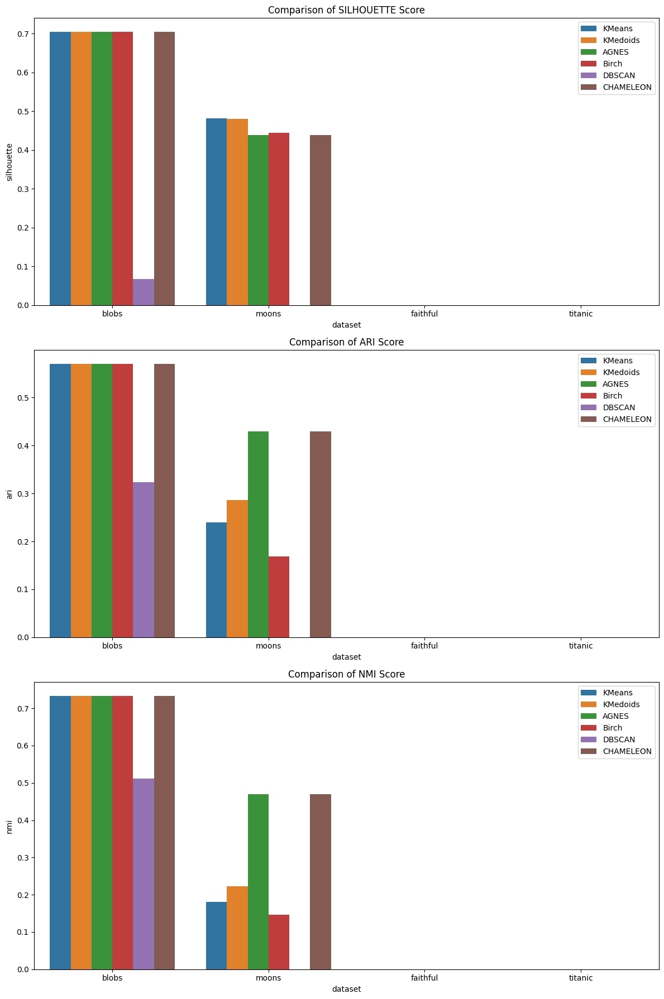

# Clustering Algorithms Comparison

This project implements and compares various clustering algorithms on synthetic and real datasets. It provides a comprehensive analysis of different clustering techniques and their performance across different types of data.

## Project Structure

```
clustering-algorithms/
├── README.md               # Project documentation
├── clustering_algorithms.py # Implementation of clustering algorithms
├── evaluate.py            # Evaluation metrics and functions
├── generate_data.py       # Synthetic dataset generation
├── plot_results.py        # Visualization of results
├── requirements.txt       # Project dependencies
├── LICENSE               # Apache 2.0 license
├── .gitignore            # Git ignore rules
└── images/
    └── clustering_comparison.png  # Performance comparison graph
```

## Algorithms Implemented

- K-Means
- K-Medoids
- Agglomerative Hierarchical Clustering (AGNES)
- BIRCH
- DBSCAN
- CHAMELEON

## Datasets

The project uses both synthetic and real datasets:

1. Synthetic:
   - Blobs
   - Moons

2. Real:
   - Old Faithful dataset
   - Titanic dataset

## Evaluation Metrics

- Silhouette Score
- Adjusted Rand Index (ARI)
- Normalized Mutual Information (NMI)

## Results

Here's a summary of the clustering results:

```
Clustering Results:
    dataset algorithm  silhouette      ari      nmi
0     blobs    KMeans    0.705284  0.570571  0.733512
1     blobs  KMedoids    0.705284  0.570571  0.733512
2     blobs     AGNES    0.705284  0.570571  0.733512
3     blobs     Birch    0.705284  0.570571  0.733512
4     blobs    DBSCAN    0.067855  0.323224  0.511117
5     blobs CHAMELEON    0.705284  0.570571  0.733512
6     moons    KMeans    0.481965  0.239339  0.181035
7     moons  KMedoids    0.480685  0.286591  0.223259
8     moons     AGNES    0.439384  0.429833  0.469005
9     moons     Birch    0.444769  0.168987  0.146109
10    moons    DBSCAN         NaN  0.000000  0.000000
11    moons CHAMELEON    0.439384  0.429833  0.469005
12 faithful    KMeans         NaN       NaN       NaN
13 faithful  KMedoids         NaN       NaN       NaN
14 faithful     AGNES         NaN       NaN       NaN
15 faithful     Birch         NaN       NaN       NaN
16 faithful    DBSCAN         NaN       NaN       NaN
17 faithful CHAMELEON         NaN       NaN       NaN
18  titanic    KMeans         NaN       NaN       NaN
19  titanic  KMedoids         NaN       NaN       NaN
20  titanic     AGNES         NaN       NaN       NaN
21  titanic     Birch         NaN       NaN       NaN
22  titanic    DBSCAN         NaN       NaN       NaN
23  titanic CHAMELEON         NaN       NaN       NaN
```

## Performance Comparison

Below is a visual comparison of the clustering algorithms' performance across different datasets:



This graph shows the Silhouette Score, Adjusted Rand Index (ARI), and Normalized Mutual Information (NMI) for each algorithm on the different datasets.

## Usage

1. Install the required dependencies:
   ```
   pip install -r requirements.txt
   ```

2. Run the main script:
   ```
   python clustering_algorithms.py
   ```

3. The script will generate datasets, perform clustering, evaluate results, and display visualizations.


## License

This project is licensed under the Apache 2.0 License. See the [LICENSE](LICENSE) file for details.

## Contributing

Contributions are welcome! Please feel free to submit a Pull Request.


